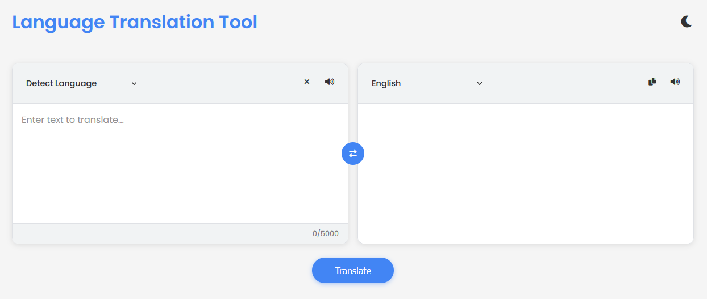

# Language Translation Tool

A web-based translation tool that utilizes Microsoft's Translator API to provide high-quality translations across multiple languages.



## Features

- **Multi-Language Support**: Translate between 100+ languages
- **Automatic Language Detection**: Automatically identifies the source language
- **Text-to-Speech**: Listen to translations with native voice support
- **Dark/Light Theme**: Choose your preferred visual theme
- **Responsive Design**: Works on desktop and mobile devices
- **Copy to Clipboard**: Easily copy translated text
- **Character Counter**: Track character count with visual indicator

## Technologies Used

- HTML5
- CSS3
- JavaScript (ES6+)
- Microsoft Azure Translator API
- Web Speech Synthesis API

## Getting Started

### Prerequisites

- A modern web browser (Chrome, Firefox, Edge, Safari)
- Microsoft Azure Translator API key (you'll need to create your own - see API Integration section below)

### Installation

1. Clone the repository or download the ZIP file
2. Extract the files to your preferred location
3. Add your Microsoft Azure API key and location to `script.js` (see API Integration section below)
4. Open `index.html` in a web browser

## Usage

### Basic Translation

1. Enter text in the left text area
2. Select the source language (or use "Detect Language")
3. Select the target language
4. Click the "Translate" button or press Enter
5. View the translated text in the right panel

### Language Detection

- Select "Detect Language" as the source language
- Enter text to translate
- The tool will automatically detect the language and show it in the dropdown

### Text-to-Speech

- Click the speaker icon next to either source or target text to hear it spoken
- The tool will attempt to use native voices for each language
- If no native voice is available, it will use any available system voice
- The speaker button is automatically disabled if no compatible voice is available

### Copy to Clipboard

- Click the copy icon to copy the translated text to clipboard
- A success notification will appear when copied

### Theme Toggle

- Click the sun/moon icon in the top-right to switch between light and dark themes
- Your preference will be saved for future visits

## API Integration

The application requires Microsoft's Azure Translator API. You must insert your own API key and location for the application to work:

### Inserting Your API Credentials

1. **Open the script.js file**
2. **Find the API Configuration section at the top**:
3. **Insert your API key and location**:

```javascript
// API Configuration
const API_KEY = "your-api-key-here";     // Insert your API Key here
const API_ENDPOINT = "https://api.cognitive.microsofttranslator.com/";
const API_LOCATION = "your-api-region";    // Insert your API Location here (e.g., "eastus")
```

**Important Security Considerations**:

- Keep your API key secure. Don't share it publicly.
- If you're hosting on GitHub Pages or any public website, your API key in script.js will be visible to anyone who views your source code.

## Text-to-Speech Implementation

The application uses the Web Speech Synthesis API to provide text-to-speech capabilities:

- Attempts to match the translation language with available system voices
- Provides clear visual feedback about voice availability
- Automatically disables the speech button when no compatible voices are available
- Implements a fallback system that works with any available voice when native voices aren't available

### Voice Compatibility

- Native voice: Uses a voice that matches the language exactly
- Fallback voice: Uses any available system voice when no native voice is found
- No voice: Disables the speech button when no voices are available

## Error Handling

The application includes robust error handling for:

- API connection issues
- Text-to-speech failures
- Language detection problems
- Copy to clipboard failures

All errors are displayed as user-friendly notifications.

## Limitations

- Maximum 5000 characters per translation
- Text-to-speech quality depends on available system voices
- API rate limits may apply depending on your Microsoft Azure subscription
